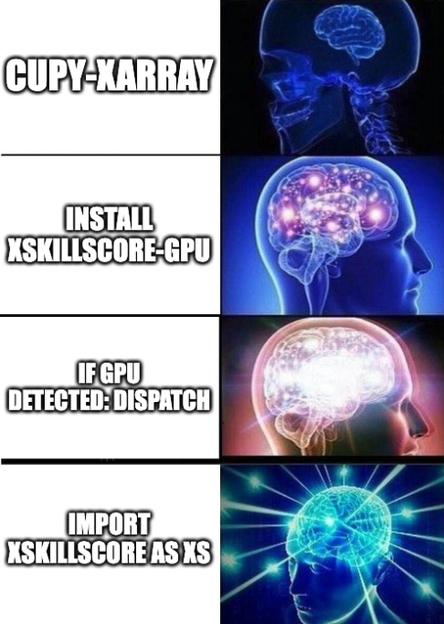

# xskillscore-gpu

WIP: Run [xskillscore](https://github.com/xarray-contrib/xskillscore) on a GPU.

## How to implement



Ideally things work with zero code changes up the stack:
 - import numpy as np; gives you speed up for `numpy` operations if you have a GPU. Probably with some fallback to CPU if memory issues etc.
 - You can currently dispatch in `numpy` if you pass a cupy array (`np.absolute(cupy_array_forecasts, cupy_array_observations)`) to `numpy` functions which is a step towards zero-code changes.
 - xarray has [cupy-xarray](https://github.com/xarray-contrib/cupy-xarray) but I would say it needs to TLC.

A simple way to proceed here is custom code which hopefully demonstrates a speed up using a GPU:
 - for loop using a numpy functions (CPU)
 - `xr.appy_unfunc` which has some acceleration build in and fit my data structure (CPU)
 - for loop using a cupy functions (GPU)
 - vectorized and parallel version using cupy and/or numba?

## Problem to solve

[weatherbench2](https://weatherbench2.readthedocs.io/en/latest/) offers data which represents the scale of the problem.

Here I want my data to fit into GPU memory (~20 Gb).

From taking a peek at the data:
```
import xarray as xr
xr.open_zarr("gs://weatherbench2/datasets/era5/1959-2022-6h-1440x721.zarr")["2m_temperature"]
```

We can generate medium sized data using an array size of (time: 1000, latitude: 721, longitude: 1440)
which is around 4GB using float32


### Setup

AWS EC2 machine g5.2xlarge with specs:
 - A10 (Compute Capability 8.6), 24 Gb GPU memory
 - 8 virtual CPUs, 32 Gb memory

AMI: Deep Learning AMI GPU PyTorch 2.1.0 (Ubuntu 20.04) (20240208; ami-0da80daf69cab6d24)

Log in using
`ssh -v -i ~/.aws/KEYNAME.pem -L 8000:localhost:8000 -L 8787:localhost:8787 -L 8888:localhost:8888 ubuntu@IPADRESS`

Edit `~/.condarc` from `channel_priority: strict` to `channel_priority: flexible`

```
$ conda init bash
$ exec bash
$ git clone https://github.com/raybellwaves/xskillscore-gpu.git
$ cd xskillscore-gpu
$ mamba env create -f env.yml
$ conda activate xskillscore-gpu-dev
$ jupyter lab
```

## Why?

Goal of zero code changes if you are an xskillscore user and you have a GPU.

## Background

### What is xskillscore?

A generic library to calculate skillscores but mostly for for weather/climate forecasts (xarray).

### How does xskillscore work?

xskillscore is mostly just a ufunc library that contains ufuncs that
are passed to [`xarray.apply_ufunc`](https://docs.xarray.dev/en/stable/generated/xarray.apply_ufunc.html).

Functions are written using `numpy` for `xarray.Dataset`'s and there
is acceleration built into xarray using `dask` and `numba`.

Traditional calcuation of skillscores happens using for loops. The example below is how someone could create the 
mean absolute error (MAE) for a few weather forecasts to create a 2D map (latitude, longitude) of MAE.
Here MAE is applied over the time dimension of two arrays (observations and forecasts).

```
mae = np.zeros((len(latitudes), len(latitudes))
for i lat in range(0, len(latitudes)):
    for j in range(0, len(latitudes)):
        mae[i, j] = np.absolute(forecasts[i, j, :], observations[i, j, :]
```

These for loops are essentially an embaraissingly parallel problem as they can be run independently.
This is what `xarray.apply_ufunc` does.


